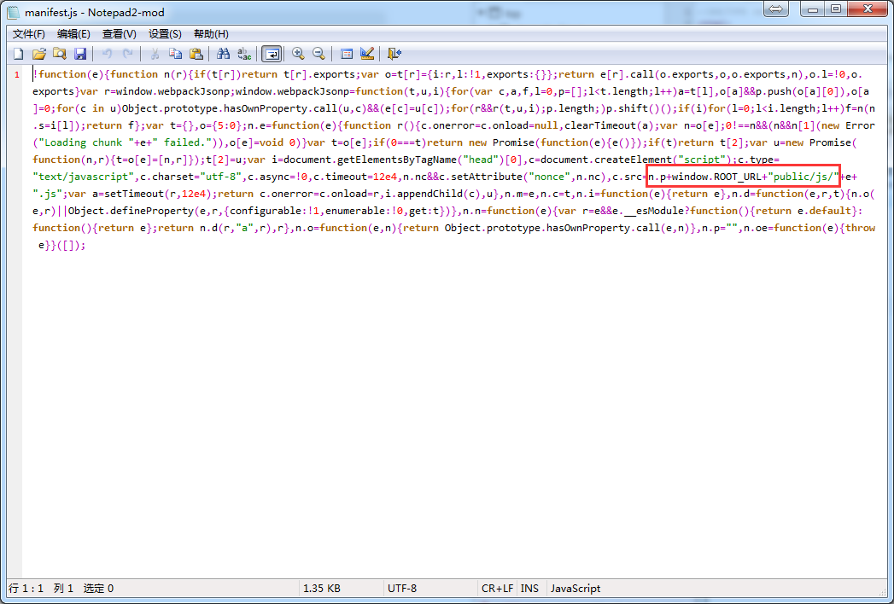

# dscmall-mobile  部分页面可视化项目

> 这是一个以 vue mvvm 模式开发的页面可视化的项目

## Build Setup

```bash
# install dependencies
npm install

# serve with hot reload at localhost:8080
npm run dev

# build for production with minification
npm run build

# build for production and view the bundle analyzer report
npm run build --report

# run unit tests
npm run unit

# run e2e tests
npm run e2e

# run all tests
npm test
```

## 目录结构

```bash
viusal
|----build //webpack 相关配置项
|----config //webpack 相关配置项
|----src //主要代码
|   |----assets //静态资源目录
|   |----components //公共组件
|   |   |----announcement //公告
|   |   |   |----data //组件数据
|   |   |   |   |----local.js //本地数据
|   |   |   |   |----online.js //线上数据用于数据库的存储展示
|   |   |----blank //空格
|   |   |----button //按钮
|   |   |----count-down //倒计时
|   |   |----coupon //优惠券
|   |   |----element //元素组件
|   |   |----jigsaw //拼图
|   |   |----line //线条
|   |   |----nav //导航
|   |   |----product //商品列表
|   |   |----search //搜索
|   |   |----shop-menu //店铺街底部菜单
|   |   |----shop-signs
|   |   |----slide //轮播图或静止广告位
|   |   |----store //店铺轮播
|   |   |----tab-down //底部导航
|   |   |----title //标题
|   |----config //本地配置项及api目录
|   |----directives //指令
|   |----filters //过滤器
|   |----index //首页入口文件夹
|   |   |----App.vue //前台首页公共引用文件
|   |   |----main.js //前台入口文件
|   |----mixins //混入
|   |----router //路由配置
|   |----store //状态管理 （注：当你不知道是否改用状态管理的时候，那么你可能不需要，当你在不使用状态管理的时候而不能进行项目的开发时请使用它）
|   |----views //页面
|   |    App.vue //后台首页公共引用文件
|   |    bootstrap.js //项目启动是配置文件
|   |    main.js //后台入口文件
|   .babelrc //babel 转码配置
|   index.html //打包后的入口文件
|   package.json //项目中的依赖插件
```

## 注意事项

```bash
var oTestCss = {// 打包使用该配置项
  test: /\.css$/,
  use: ExtractTextPlugin.extract({
    fallback: "style-loader",
    use: [
      {
        loader: 'css-loader',
        options: {
          minimize: true //css压缩
        }
      }
    ]
  })
}

var oEntry = { //打包时使用该配置项
  app: './src/index/main.js',
  backend: './src/main.js',
}

module.exports = {
  entry: process.env.NODE_ENV !== 'production' ? {
    // 在开发模式下使用该方式，app 打开的是 前台页面 backend 打开的是 后台页面
    // 两者模式不能同时使用
    app: './src/index/main.js',
    // backend: './src/main.js',
  } : oEntry,
  output: {
    path: config.build.assetsRoot,
    filename: '[name].js',
    publicPath: process.env.NODE_ENV === 'production'
      ? config.build.assetsPublicPath
      : config.dev.assetsPublicPath
  }
  ...
}
```

你不喜欢太长太乱的引入路径的时候可以试试配置 build/webpack.base.conf.js 中的 alias 的对象，这样一来你就可以使用你配置的变量来替代冗余的引入地址了，如果是样式sass，less可在前面增加 ~ 线 例如：'~@/assets/style/theme/index'

```bash
    alias: {
      'vue$': 'vue/dist/vue.common.js',
      'src': resolve('src'),
      'assets': resolve('src/assets'),
      'config': resolve('src/config'),
      'mixins': resolve('src/mixins'),
      'components': resolve('src/components'),
      'views': resolve('src/views'),
      'html2canvas': 'assets/js/html2canvas.min'
    }
```

你不希望你打包的代码在浏览器被查看其源码结构可以修改 build/webpack.prod.conf.js 文件将 sourceMap 改为 false

```bash
...
plugins: [
    // http://vuejs.github.io/vue-loader/en/workflow/production.html
    new webpack.DefinePlugin({
      'process.env': env
    }),
    new webpack.optimize.UglifyJsPlugin({
      compress: {
        warnings: false,
        drop_debugger: true,
        drop_console: true
      },
      sourceMap: true
    })
    ...
]
```

实际打包中为了因为一些优化部署的原因，默认情况打包的 js 或 css 文件都会有 hash 值得存在，若不需要请修改 build/webpack.prod.conf.js 文件

```bash
...
output: {
    path: config.build.assetsRoot,
    // filename: utils.assetsPath('js/[name].[chunkhash].js'),
    // chunkFilename: utils.assetsPath('js/[id].[chunkhash].js')
    filename: utils.assetsPath('js/[name].js'),
    chunkFilename: utils.assetsPath('js/[id].js')
  }
  ....
```

在打包的时候我们可能会因为现有项目的文件结构的设计需要合理的更改打包输出的文件路径 请修改 config/index.js 文件

```bash
 build: {
       ...
        assetsSubDirectory: 'public',  //设置静态资源的输出的文件夹名称
        assetsPublicPath: '', //设置静态资源的文件的输出路径 空位  相对路径
       ...
    },
```

我们在开发过程中对接 api 的时候，本地服务和前端项目的端口是不一样的，或者是使用其他 ip 的地址进行 api 对接，这个时候我们需要使用反向代理 请修改 config/index.js

```bash
    dev: {
        env: require('./dev.env'),
        port: 8080, //启动端口
        autoOpenBrowser: true,
        assetsSubDirectory: 'static',
        assetsPublicPath: '/',
        proxyTable: {
            '/mobile': { //设置替代的名字
                //配置的名字
                target: 'http://localhost/dsc_mall/', //本地代理地址 可换成其他电脑的ip地址
                changeOrigin: true, //开启代理
                pathRewrite: {
                    '^/mobile': '/mobile' //这里重写路径/run就代理到对应地址
                }
            }
        }
        ...
    }
```

在实际开发中你可能会对浏览器输出很多的东西 比如 console.log console.error 等等，那么在打包的时候怎么一次性剔除 请修改 build/webpack.prod.conf.js

```bash
 plugins: [
    // http://vuejs.github.io/vue-loader/en/workflow/production.html
    new webpack.DefinePlugin({
      'process.env': env
    }),
    new webpack.optimize.UglifyJsPlugin({
      compress: { // 设置是否剔除输出的 console
        warnings: false,
        drop_debugger: true,
        drop_console: true
      },
      sourceMap: true
    })
 ]
```

最后一步，如果网站启用了伪静态之后，可能会导致类似商家店铺页面的js加载出现问题。
那么就需要修改 public/js/manifest.js 文件中 public/js 前缀来修改 相对路径 导致的加载失败的问题。

```
+window.ROOT_URL
```



如果你对 webpack 不是很熟悉可以浏览以下文档进行学习：  
http://www.css88.com/doc/webpack/
